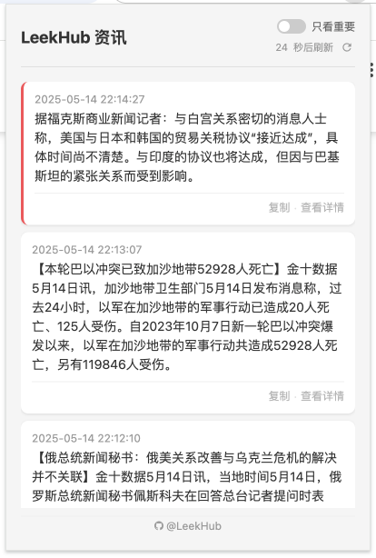

# LeekHub 金十数据 Chrome 扩展

一个简单的 Chrome 扩展，用于展示实时财经新闻。

## 功能特点

- 实时展示实时财经新闻
- 支持只查看重要新闻的过滤功能
- 简洁美观的用户界面
- 自动定期更新新闻内容



## 安装说明

1. 下载本扩展的所有文件
2. 打开 Chrome 浏览器，进入扩展管理页面（chrome://extensions/）
3. 开启右上角的"开发者模式"
4. 点击"加载已解压的扩展程序"
5. 选择本扩展的文件夹

## 使用说明

1. 点击 Chrome 工具栏中的扩展图标打开新闻窗口
2. 使用"只看重要"开关来过滤显示重要新闻
3. 点击任意新闻项目可跳转到金十数据官网查看更多详情
4. 新闻内容每30秒自动更新一次


## 隐私说明

本扩展仅获取并展示金十数据网站的公开新闻信息，不会收集任何用户个人数据。 

## 开发说明

```code
leekhub-finews-extension/
├── manifest.json        // 扩展配置文件
├── popup.html          // 弹出窗口界面
├── popup.js           // 主要逻辑代码
├── styles.css         // 样式文件
├── README.md          // 说明文档
└── images/            // 图标目录
    ├── icon16.png
    ├── icon48.png
    └── icon128.png
```